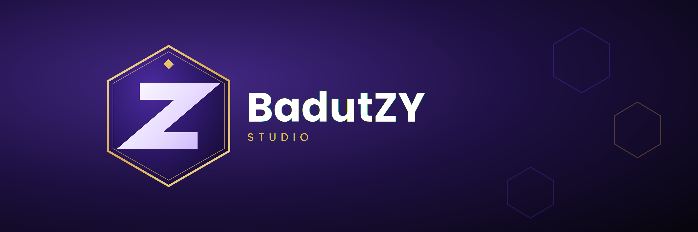
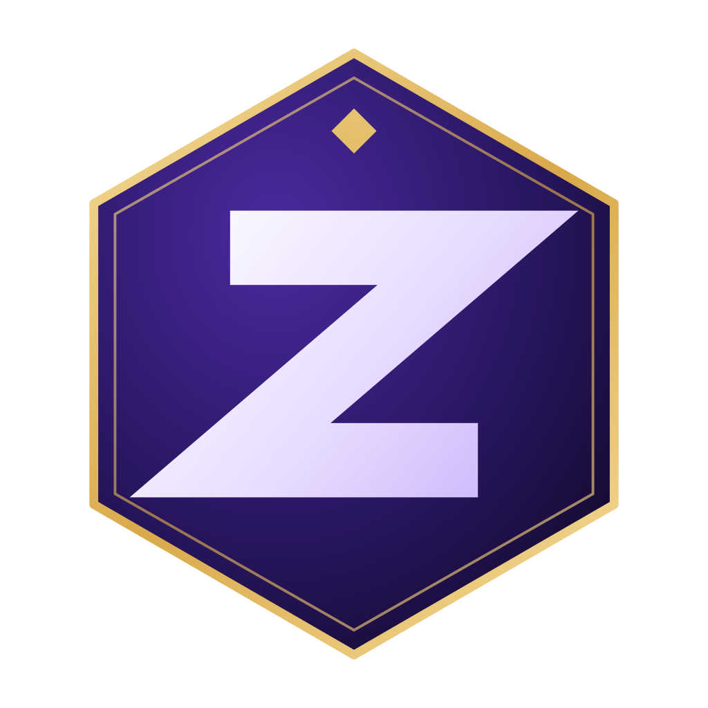
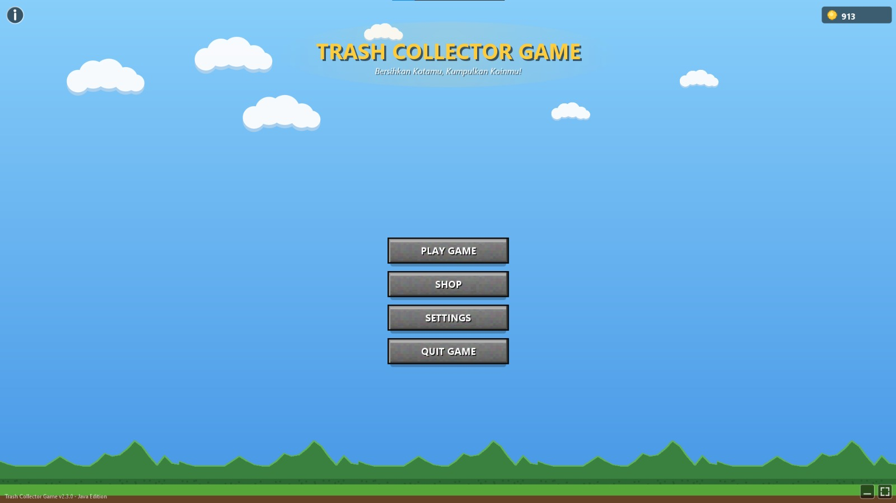
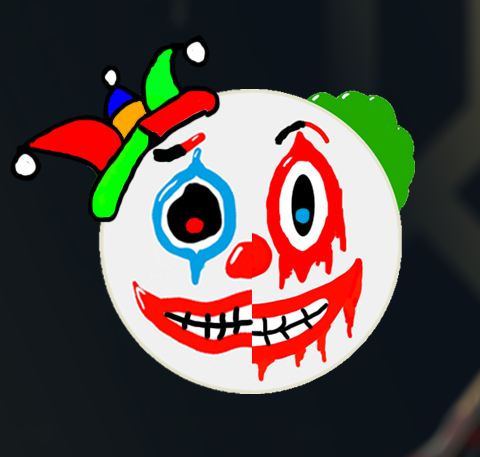

# BadutZY Studio

**A Solo Indie Game Development Studio**

[About](#about) • [Games](#our-games) • [Tech Stack](#tech-stack) • [Founder](#founder)

---

## About

BadutZY Studio is a solo indie game development studio. Unlike a typical team-based studio, every part of the process - from concept, design, programming, art direction, to release - is handled by a single person. This studio was built as a space to freely explore ideas without being tied to a large team structure, while still holding on to the same standard of quality and dedication as any other studio.

Working solo comes with its own challenges, but it also means every decision, every mechanic, and every detail in each project reflects a single clear vision. BadutZY Studio focuses on building games that are simple in scope but well thought out in execution, with room to grow as more projects and experience are added over time.

---

## Vision and Mission

- **Vision** - To grow into a personal creative space that can consistently produce original and polished games, one project at a time.
- **Mission** - To build games independently with care and attention to detail, and to keep improving with every project released.

---

## Our Games

  **TrashCollectorGame**
  
  

---

## How This Studio Works

As a one-person studio, BadutZY Studio does not follow a traditional team pipeline. Instead, each project moves through the following stages, all handled individually:

| Stage | Description |
|---|---|
| Concept | Coming up with the core idea, theme, and scope of a project |
| Design | Planning mechanics, levels, and overall game feel |
| Development | Programming the game using the chosen engine and tools |
| Testing | Playtesting and refining the game before release |
| Release | Publishing the finished game to the intended platform |

---

## Tech Stack

   

      

  

 

---

## Founder

**BadutZY**

Founder, developer, designer, and everything else - BadutZY Studio is a one-person operation run entirely by BadutZY.

---

*Built alone, made with dedication.*

[Back to Top](#badutzy-studio)

